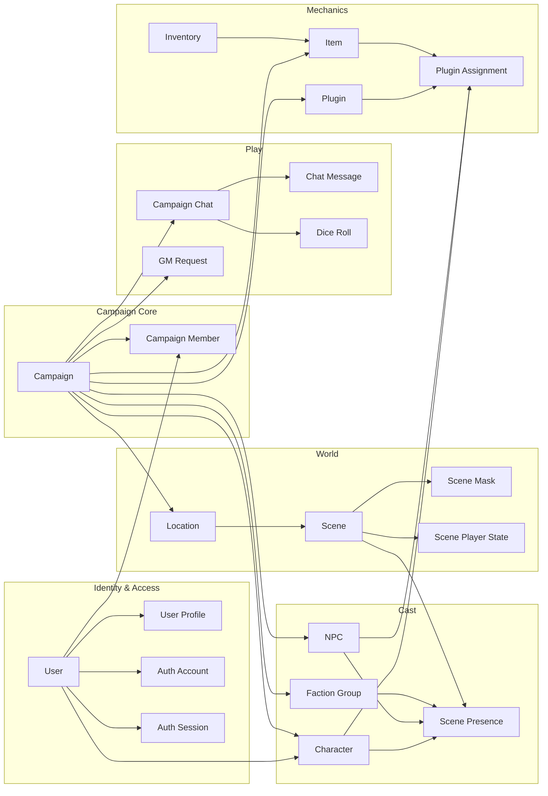
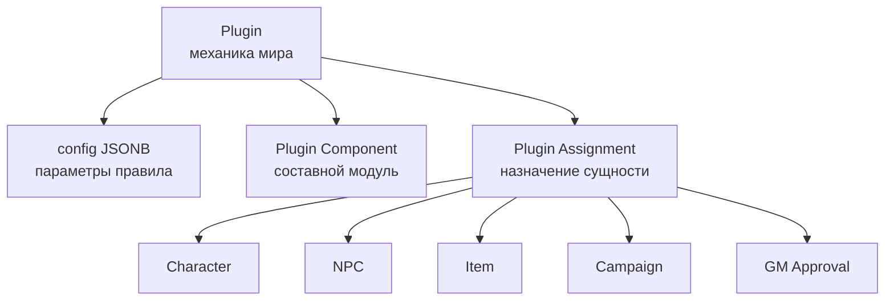
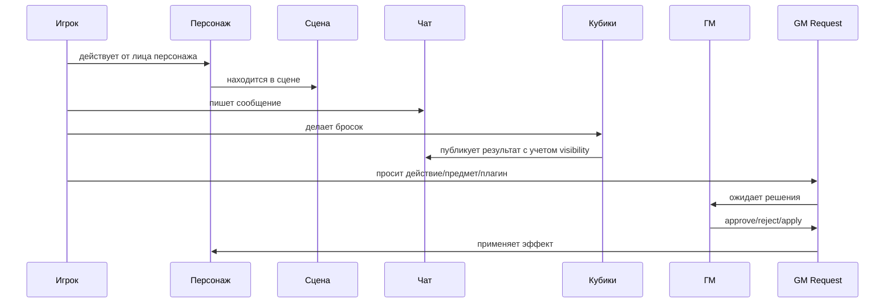

# LoreForge: доменная модель RPG-платформы

Источник: `dnd_campaign_schema.sql`  
Назначение: доменная модель для презентации, проектирования API и дальнейшей разработки платформы.

## 1. Идея модели

**LoreForge** - это операционная система для мастера настольной RPG-кампании.

В центре системы находится **кампания**. Вокруг нее живут пользователи, персонажи, NPC, локации, сцены, чат, броски кубов, предметы, отношения, секреты ГМа, расследования и подключаемые плагины правил.

Ключевое отличие от обычного virtual tabletop:

- Roll20 хранит игровой стол: карту, токены, кубики.
- Notion хранит лор: страницы, заметки, связи.
- LoreForge объединяет оба подхода и добавляет модульные правила мира.

```mermaid
flowchart TB
    Campaign["Campaign\nкампания как центр мира"]

    Users["Users & Auth\nигроки, ГМ, сессии"]
    World["World Structure\nлокации, сцены, маски, доступ"]
    Cast["Cast\nперсонажи, NPC, фракции"]
    Tabletop["Virtual Tabletop\nкарты, изображения, токены"]
    Knowledge["Lore & Secrets\nпубличные знания, секреты ГМа, доступы"]
    Inventory["Inventory & Items\nпредметы, инвентари, заявки"]
    Rules["Plugin Rules Engine\nмеханики, способности, состояния"]
    Social["Relations & Investigations\nотношения, расследования"]
    Play["Live Play\nчат, броски, запросы к ГМу"]
    Files["Attachments\nфайлы, изображения, права доступа"]

    Campaign --> Users
    Campaign --> World
    Campaign --> Cast
    Campaign --> Tabletop
    Campaign --> Knowledge
    Campaign --> Inventory
    Campaign --> Rules
    Campaign --> Social
    Campaign --> Play
    Campaign --> Files
```



## 2. Bounded Contexts

| Контекст | Назначение | Таблицы |
|---|---|---|
| Identity & Access | Пользователи, профили, аккаунты, сессии, токены подтверждения | `app_user`, `user_profile`, `auth_account`, `auth_session`, `email_verification_token`, `password_reset_token` |
| Campaign Core | Кампания, роли, участники | `campaign`, `campaign_member` |
| World Map | Иерархия локаций, сцены, видимость сцен, fog of war | `location`, `scene`, `scene_mask`, `scene_player_state`, `scene_image` |
| Cast & Factions | Игровые персонажи, NPC, группы/фракции, присутствие на сцене | `character`, `npc`, `faction_group`, `scene_presence` |
| Knowledge & Visibility | Что игрок/персонаж знает о мире | `player_npc_access`, `player_location_access`, `character_known_npc`, `character_known_location` |
| Assets | Вложения и права на файлы | `attachment`, `attachment_access` |
| Tabletop Tokens | Токены персонажей и их размещение на сценах | `token`, `token_placement` |
| Inventory | Предметы, инвентари, заявки на добавление/удаление | `item`, `inventory`, `inventory_entry` |
| Plugin System | Модульные правила, способности, состояния, компоненты и назначения | `plugin`, `plugin_component`, `plugin_assignment` |
| Relationship Graph | Отношения между персонажами, NPC и группами | `entity_relation` |
| Live Session | Чаты, сообщения, броски кубов | `campaign_chat`, `chat_message`, `dice_roll` |
| GM Workflow | Запросы игроков к мастеру и примененные эффекты | `gm_request`, `gm_request_effect` |
| Investigation | Дела, квесты, расследования и связанные улики | `investigation`, `investigation_link` |

## 3. Карта агрегатов



## 4. Главные сущности

### User

**Пользователь платформы**. Может быть мастером, игроком или владельцем персонажей.

Состав:

- `app_user` - базовая учетная запись в продукте.
- `user_profile` - профиль, локаль, часовой пояс, пользовательские настройки.
- `auth_account` - email, пароль, статус подтверждения.
- `auth_session` - активные сессии и refresh-токены.
- `email_verification_token`, `password_reset_token` - жизненный цикл безопасности аккаунта.

Важная мысль: пользователь не равен персонажу. Один пользователь может участвовать в разных кампаниях и владеть разными персонажами.

### Campaign

**Корневой агрегат всей игры**.

Хранит:

- название и сеттинг;
- описание;
- владельца-ГМа;
- публичный журнал;
- журнал мастера;
- участников и их роли.

Правила:

- кампания принадлежит одному `gm_user_id`;
- в `campaign_member` может быть только один участник с ролью `gm` на кампанию;
- почти все игровые сущности удаляются каскадом вместе с кампанией.

### Location

**Узел мира**: город, район, таверна, подземелье, комната, планета, сектор.

Особенности:

- поддерживает вложенность через `parent_location_id`;
- содержит публичное и секретное описание;
- может иметь карту;
- поддерживает сетку: размер клетки, смещение, цвет, прозрачность.

Это делает локации не просто текстовыми страницами, а основой для карты, сцен и знаний игроков.

### Scene

**Игровая сцена внутри локации**.

Например:

- "бой в тронном зале";
- "ночной разговор на крыше";
- "засада в переулке";
- "исследование древней библиотеки".

Сцена содержит:

- публичное описание;
- описание для ГМа;
- тип сцены;
- сортировку;
- активность;
- маски видимости;
- изображения;
- токены и присутствующие сущности.

### Character

**Игровой персонаж игрока**.

Содержит:

- владельца-игрока;
- текущую локацию;
- текущую сцену;
- публичное и секретное описание;
- заметки;
- статус.

Через плагины персонаж получает классы, способности, состояния, ресурсы и любые кастомные механики.

### NPC

**Досье NPC для мастера**.

Содержит:

- имя и титул;
- принадлежность к группе/фракции;
- публичное описание;
- секретное описание;
- отдельные секреты ГМа;
- журнал NPC;
- статус.

Это одна из ключевых фишек LoreForge: NPC - не просто токен на карте, а полноценная лор-сущность с секретами, связями и доступом игроков.

### Faction Group

**Фракция, организация, семья, культ, банда, государство или любая группа**.

Используется для:

- принадлежности NPC;
- отношений между группами и персонажами;
- расследований;
- присутствия на сцене как коллективной сущности.

### Plugin

**Модуль правил или механик мира**.

Типы из схемы:

- `state` - состояние;
- `stat` - характеристика;
- `ability` - способность;
- `proficiency_bonus` - бонус мастерства;
- `description` - описательный модуль;
- `credit` - ресурс/валюта/очки;
- `mixed` - смешанный модуль;
- `other` - произвольный тип.

Плагин может быть:

- скрыт от других игроков;
- видим владельцу;
- всегда видим ГМу;
- доступен только через взаимодействие с ГМом;
- редактируем, удаляем и добавляем ГМом;
- настроен через `config JSONB`.

Это главный механизм, который превращает LoreForge из DnD-схемы в платформу для разных миров.

## 5. Детальная ER-модель

```mermaid
erDiagram
    APP_USER ||--o| USER_PROFILE : has
    APP_USER ||--o| AUTH_ACCOUNT : has
    APP_USER ||--o{ AUTH_SESSION : opens
    APP_USER ||--o{ CAMPAIGN : masters
    APP_USER ||--o{ CAMPAIGN_MEMBER : joins
    APP_USER ||--o{ CHARACTER : owns

    CAMPAIGN ||--o{ CAMPAIGN_MEMBER : contains
    CAMPAIGN ||--o{ LOCATION : contains
    CAMPAIGN ||--o{ CHARACTER : contains
    CAMPAIGN ||--o{ NPC : contains
    CAMPAIGN ||--o{ FACTION_GROUP : contains
    CAMPAIGN ||--o{ ATTACHMENT : owns
    CAMPAIGN ||--o{ ITEM : contains
    CAMPAIGN ||--o{ PLUGIN : defines
    CAMPAIGN ||--o{ CAMPAIGN_CHAT : has
    CAMPAIGN ||--o{ DICE_ROLL : records
    CAMPAIGN ||--o{ GM_REQUEST : receives
    CAMPAIGN ||--o{ INVESTIGATION : tracks

    LOCATION ||--o{ LOCATION : contains
    LOCATION ||--o{ SCENE : hosts
    LOCATION ||--o{ CHARACTER : current_location
    LOCATION ||--o{ INVENTORY : owns

    SCENE ||--o{ SCENE_MASK : hides
    SCENE ||--o{ SCENE_PLAYER_STATE : visible_state
    SCENE ||--o{ SCENE_IMAGE : layers
    SCENE ||--o{ SCENE_PRESENCE : includes
    SCENE ||--o{ TOKEN_PLACEMENT : places
    SCENE ||--o{ CAMPAIGN_CHAT : contextual_chat

    FACTION_GROUP ||--o{ NPC : includes
    FACTION_GROUP ||--o{ SCENE_PRESENCE : appears

    CHARACTER ||--o{ TOKEN : has
    CHARACTER ||--o{ SCENE_PRESENCE : appears
    CHARACTER ||--o{ INVENTORY : owns
    CHARACTER ||--o{ PLUGIN_ASSIGNMENT : receives
    NPC ||--o{ SCENE_PRESENCE : appears
    NPC ||--o{ INVENTORY : owns
    NPC ||--o{ PLUGIN_ASSIGNMENT : receives

    ATTACHMENT ||--o{ ATTACHMENT_ACCESS : grants
    ATTACHMENT ||--o{ SCENE_IMAGE : used_as
    ATTACHMENT ||--o{ CHAT_MESSAGE : attached_to

    TOKEN ||--o{ TOKEN_PLACEMENT : placed

    INVENTORY ||--o{ INVENTORY_ENTRY : contains
    ITEM ||--o{ INVENTORY_ENTRY : listed
    ITEM ||--o{ PLUGIN_ASSIGNMENT : receives

    PLUGIN ||--o{ PLUGIN_COMPONENT : parent
    PLUGIN ||--o{ PLUGIN_ASSIGNMENT : assigned

    CAMPAIGN_CHAT ||--o{ CHAT_MESSAGE : contains
    CAMPAIGN_CHAT ||--o{ DICE_ROLL : shows

    GM_REQUEST ||--o{ GM_REQUEST_EFFECT : applies
    INVESTIGATION ||--o{ INVESTIGATION_LINK : links
```



## 6. Видимость и секреты

В модели явно заложена разница между знанием игрока, персонажа и мастера.

### Уровни информации

| Уровень | Где хранится | Кто видит |
|---|---|---|
| Публичное описание | `public_description`, `public_journal` | Игроки и ГМ |
| Секретное описание | `secret_description` | Обычно ГМ |
| Секреты ГМа | `gm_secrets`, `gm_journal`, `gm_description` | Только ГМ |
| Персональный доступ игрока | `player_npc_access`, `player_location_access`, `attachment_access` | Конкретные игроки |
| Знание персонажа | `character_known_npc`, `character_known_location` | Через персонажа |
| Видимость сцены | `scene_player_state`, `scene_mask` | По сцене/игроку |
| Видимость бросков | `dice_roll.visibility` | public / gm_only / private |
| Видимость плагинов | поля `plugin.is_*` | зависит от правил плагина |

### Доменное правило

Игрок не должен видеть сущность только потому, что она существует в кампании. Доступ определяется отдельными таблицами доступа, состоянием сцены, видимостью сообщений, настройками плагинов и ролью пользователя.

## 7. Модульная система правил



Примеры, которые хорошо ложатся на эту модель:

- DnD: класс, уровень, бонус мастерства, заклинания, состояния.
- Mistbound/LoTM-like: путь, последовательность, ритуалы, риски, безумие.
- Cyberpunk: импланты, кредиты, репутация, перегрев.
- Постапокалипсис: радиация, мутации, ресурсы убежища.
- Авторский мир: любые кастомные шкалы и способности через `config`.

Сильная сторона схемы: плагин назначается не только персонажу, но и NPC, предмету или кампании. Значит предмет может давать механику, NPC может иметь скрытую способность, а вся кампания может включать глобальное правило мира.

## 8. Игровой процесс



## 9. Модель отношений

`entity_relation` делает социальную и политическую карту кампании.

Связь может идти между:

- персонажем;
- NPC;
- группой/фракцией.

У связи есть:

- `relation_kind` - тип отношения;
- `strength` от `-100` до `100`;
- `description` - пояснение.

Примеры:

- персонаж доверяет NPC на `70`;
- фракция ненавидит другую фракцию на `-90`;
- NPC должен долг персонажу;
- группа тайно контролирует NPC.

Это дает основу для графа интриг, дипломатии, расследований и динамического лора.

## 10. Расследования

`investigation` и `investigation_link` позволяют вести дела, тайны, квесты и цепочки улик.

Расследование может ссылаться на:

- NPC;
- локации;
- группы.

Так LoreForge покрывает не только боевую игру, но и кампании про интриги, детективы, тайные культы, политические конфликты и mystery-сюжеты.

## 11. Инвентарь и заявки

Инвентарь может принадлежать:

- персонажу;
- NPC;
- локации;
- кампании.

Это важно: предмет может лежать не только "у игрока", но и в комнате, у NPC, в общем фонде кампании или в сундуке локации.

`inventory_entry.approval_status` и `gm_request` позволяют сделать честный игровой процесс:

- игрок просит добавить предмет;
- мастер подтверждает;
- система создает эффект;
- изменение попадает в журнал действий.

## 12. Точки роста схемы

Схема уже хорошо покрывает ядро LoreForge. Для следующего уровня продукта стоит добавить:

| Зона | Что добавить | Зачем |
|---|---|---|
| Session Journal | `game_session`, `session_event` | Отдельный журнал игровых сессий, события по времени |
| Audit Log | `audit_event` | Кто, когда и что поменял |
| Rule Packs | глобальные шаблоны плагинов вне кампании | Переиспользуемые DnD/Cyberpunk/авторские наборы |
| Character Sheet | шаблон листа персонажа | UI-слой для плагинов и статов |
| Permissions | роли шире `gm/player` | Co-GM, spectator, guest, editor |
| Map Tools | зоны, линии, измерения | Более полноценный tabletop-режим |
| Secrets | отдельная сущность `secret` | Секреты можно привязывать к чему угодно |
| Timeline | `world_event` | История мира и хронология кампании |
| Quest Log | `quest`, `quest_step` | Квесты отдельно от расследований |
| Notifications | `notification` | Уведомления игрокам и ГМу |

## 13. Итоговая формула продукта

```text
LoreForge = Campaign OS + Virtual Tabletop + Lore Database + Modular Rules Engine
```

То есть:

- Campaign OS: кампания, участники, роли, заявки, журнал решений.
- Virtual Tabletop: сцены, карты, сетка, токены, fog of war, чат, кубики.
- Lore Database: NPC, локации, фракции, отношения, расследования, секреты.
- Modular Rules Engine: плагины механик, способностей, состояний и ресурсов.

Главная ценность:

> LoreForge помогает мастеру не просто провести сессию, а управлять живым миром кампании: лором, правилами, персонажами, тайнами, сценами и последствиями решений игроков.

